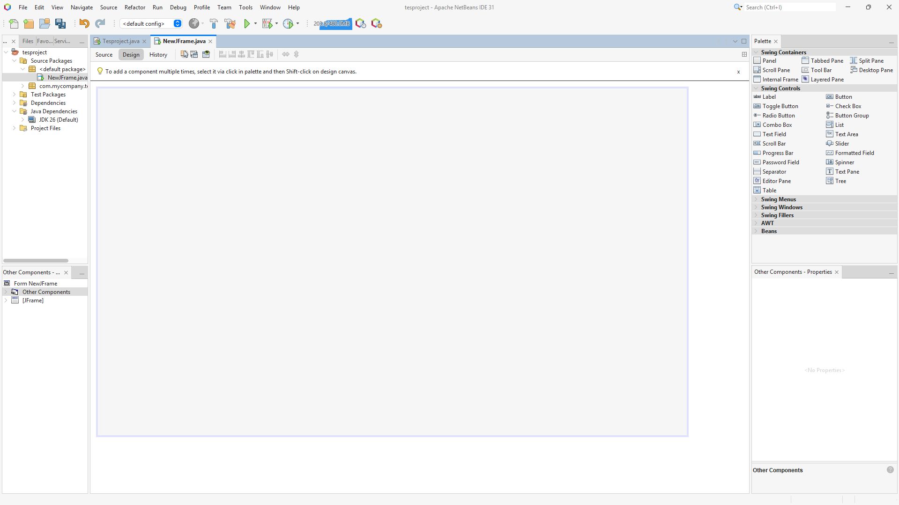
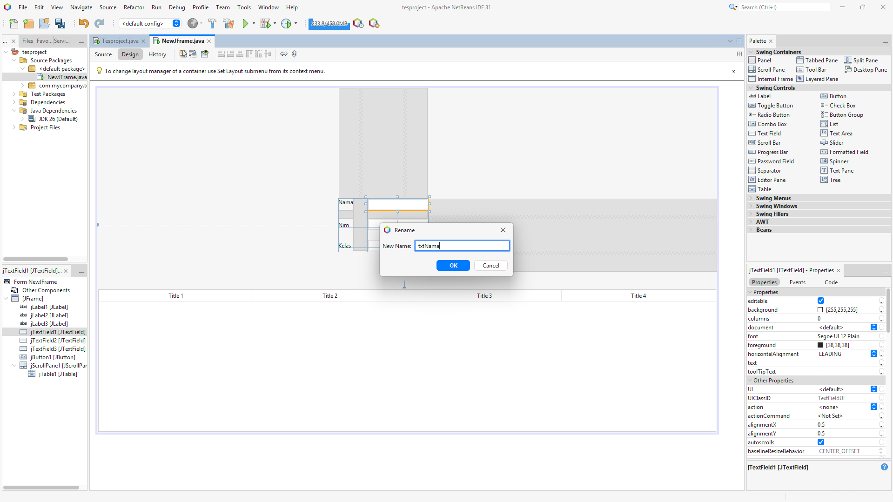

# Topik 11 - GUI dengan Java Swing

---

## 🎯 Tujuan Pembelajaran

Setelah mengikuti pertemuan ini, Anda diharapkan mampu:

1. Memahami apa itu Graphical User Interface (GUI) dan perbedaannya dengan aplikasi berbasis konsol.
2. Membuat tampilan aplikasi menggunakan lima komponen dasar Java Swing: JFrame, JLabel, JTextField, JButton, dan JTable.
3. Menampilkan dan memperbarui isi JTable menggunakan DefaultTableModel.
4. Membuat tombol dan tabel yang bereaksi terhadap klik pengguna (event handling).
5. Menghubungkan tampilan GUI dengan database melalui BukuController dan BukuDAO untuk membuat aplikasi CRUD sederhana: Tambah, Edit, Lihat, dan Hapus data buku.
6. Menampilkan notifikasi (JOptionPane) ketika pengguna salah mengisi data

---

## 🔑 KATA KUNCI UTAMA (KEY WORDS)

Pada materi ini, terdapat komponen dan konsep utama yang wajib Anda pahami fungsinya:

* **`GUI`** : *Graphical User Interface*, yaitu tampilan aplikasi berupa jendela, tombol, dan kolom isian, sehingga pengguna cukup mengeklik dan mengetik, bukan menjalankan perintah teks.
* **`JFrame`** : Jendela utama aplikasi. Semua komponen lain diletakkan di atasnya.
* **`Komponen Swing`** : Bagian-bagian tampilan yang kita susun, yaitu `JLabel` (teks keterangan), `JTextField` (kolom isian), dan `JButton` (tombol).
* **`JTable`** : Komponen untuk menampilkan data dalam bentuk baris dan kolom. Fungsinya hanya sebagai **tampilan**.
* **`DefaultTableModel`** : "Isi" dari sebuah `JTable`. Menambah atau mengosongkan baris tabel dilakukan lewat model ini.
* **`Event` dan `ActionListener`** : *Event* adalah kejadian yang dilakukan pengguna (misalnya klik tombol). `ActionListener` adalah "telinga" yang mendengarkan kejadian itu lalu menjalankan kode yang kita siapkan.
* **`Controller`** : Perantara antara tampilan dan database. Tugasnya memeriksa isian dari form, lalu meneruskannya ke `BukuDAO`.

---

## 📂 RESOURCES

> 💡 **File demo dan database tersedia di folder `Contoh-Kode/Pertemuan-8`**

| File | Deskripsi |
| :--- | :--- |
| `db_perpustakaan_mini.sql` | Script SQL pembuatan database mini dan tabel `buku` |
| `src/model/Buku.java` | *Blueprint* objek `Buku` |
| `src/model/dao/BukuDAO.java` | Kumpulan query CRUD dengan JDBC |
| `src/controller/BukuController.java` | Perantara antara form dan DAO, sekaligus memeriksa isian form |
| `src/view/FormBuku.java` | Form GUI berisi kolom isian, empat tombol CRUD, dan tabel |
| `src/main/Main.java` | *Entry point* untuk menampilkan `FormBuku` |

---

## 📋 PERSIAPAN SEBELUM MEMULAI

Sebelum memulai materi ini, pastikan Anda sudah memahami dasar-dasar pemrograman Java dari materi sebelumnya, terutama:

* [ ] Apache NetBeans IDE sudah terbuka dan JDK terkonfigurasi dengan benar.
* [ ] Laragon / XAMPP sudah terinstall dan **service MySQL sudah berjalan (Start)**.
* [ ] Project praktik sederhana dari Pertemuan 7 sudah tersedia, berisi class `Koneksi`, `Buku`, dan `BukuDAO`.
* [ ] *Dependency* `mysql-connector-j` sudah terpasang di `pom.xml`.
* [ ] `TestKoneksi` pernah dijalankan dan menampilkan pesan **STATUS: BERHASIL**.

---

## 🚀 PART 1: Pemahaman Konsep
```text
                 ┌──────────────────────────────┐
                 │     JFrame (FormBuku)        │
                 └──────────────┬───────────────┘
                                │ (berisi komponen)
      ┌──────────────┬──────────┼───────────┬───────────────┐
      │              │          │           │               │
┌─────┴─────┐ ┌──────┴─────┐ ┌──┴───────┐ ┌─┴──────────────┐
│  JLabel   │ │ JTextField │ │ JButton  │ │ JTable         │
│ (Teks)    │ │ (Isian)    │ │ (Tombol) │ │ (Tampilan data)│
└───────────┘ └────────────┘ └──────────┘ └───────┬────────┘
                                                  │
                                         ┌────────┴────────┐
                                         │DefaultTableModel│
                                         │ (Isi tabel)     │
                                         └─────────────────┘
```

> 📌 **ANALOGI DUNIA NYATA:**
> * **Aplikasi Konsol** ibarat pelayan warung tradisional yang mencatat pesanan Anda baris demi baris. Kalau salah mengetik, program langsung berhenti.
> * **Aplikasi GUI** ibarat layar pemesanan mandiri di restoran cepat saji. Ada tulisan petunjuk (`JLabel`), kolom isian (`JTextField`), dan tombol (`JButton`). Pelanggan bebas menyentuh bagian mana saja, dan mesin baru bekerja ketika layar benar-benar disentuh.
 
---
 
### 1. Apa itu GUI dan Java Swing?
 
**GUI** adalah tampilan aplikasi yang bisa dilihat dan diklik, seperti aplikasi yang biasa kita pakai sehari-hari. **Java Swing** adalah kumpulan komponen bawaan Java untuk membuat GUI pada aplikasi desktop.
 
Aplikasi konsol berjalan **berurutan**: program bertanya, kita menjawab, lalu lanjut ke pertanyaan berikutnya. Aplikasi GUI berbeda. Program **menunggu**, dan baru bekerja saat pengguna melakukan sesuatu, seperti mengeklik tombol. Itulah mengapa aplikasi GUI disebut bekerja berdasarkan *event* (kejadian).
 
### 2. Komponen yang Dipakai pada CRUD Buku
 
Swing memiliki banyak komponen, misalnya kotak pilihan dan menu. Namun, untuk membuat CRUD sederhana, **lima komponen berikut sudah cukup**:
 
| Komponen | Fungsi | Dipakai untuk |
| :--- | :--- | :--- |
| `JFrame` | Jendela utama aplikasi | Wadah seluruh tampilan (`FormBuku`) |
| `JLabel` | Menampilkan teks keterangan | Tulisan "ID Buku", "Judul Buku", "Stok Buku" |
| `JTextField` | Kolom tempat pengguna mengetik. Isinya diambil dengan `getText()` dan **selalu berupa teks (`String`)** | Mengisi ID, judul, dan stok buku |
| `JButton` | Tombol yang memicu aksi saat diklik | Tombol Tambah, Edit, Lihat, dan Hapus |
| `JTable` | Menampilkan data dalam baris dan kolom | Menampilkan daftar buku dari database |
 
> 💡 Pada form sederhana, komponen langsung diletakkan di atas `JFrame`. Komponen `JPanel` baru diperlukan jika tampilan sudah besar dan perlu dikelompokkan, misalnya satu panel untuk form isian dan satu panel untuk tabel.
 
### 3. JTable dan DefaultTableModel
 
`JTable` ibarat **kaca etalase toko**: ia hanya memajang. Barang yang dipajang disimpan di dalam **`DefaultTableModel`**. Karena itu, untuk menambah atau mengosongkan baris, yang kita ubah adalah **model**-nya, bukan tabelnya.
 
```java
DefaultTableModel tabelModel = new DefaultTableModel();   // 1. Buat model (isi tabel)
tabelModel.addColumn("ID Buku");                          // 2. Tentukan kolomnya
tblBuku.setModel(tabelModel);                             // 3. Pasang model ke tabel
tabelModel.addRow(new Object[]{"B001", "Java", 5});       // 4. Tambah satu baris lewat model
```
 
### 4. Event dan ActionListener
 
Sebuah tombol tidak akan melakukan apa-apa sebelum kita memberi tahu apa yang harus dikerjakan saat diklik. Di NetBeans, caranya mudah: **double-click** tombolnya di mode Design. NetBeans akan menuliskan dua hal:
 
```java
// 1. Di dalam initComponents() (bagian kode abu-abu, dibuat otomatis):
//    "Telinga" yang mendengarkan klik pada tombol Tambah
btnTambah.addActionListener(this::btnTambahActionPerformed);
 
// 2. Method kosong, tempat kita menulis apa yang terjadi saat tombol diklik
private void btnTambahActionPerformed(java.awt.event.ActionEvent evt) {
    // kode kita ditulis di sini
}
```
 
Artinya: *"Setiap kali tombol Tambah diklik, jalankan method `btnTambahActionPerformed`."* Kita hanya perlu mengisi bagian kedua.
 
### 5. GUI dalam Struktur MVC
 
Pada Pertemuan 7, tampilan aplikasi berupa konsol. Sekarang tampilan itu kita ganti dengan GUI (`FormBuku`). Agar kode tetap rapi, tugas dibagi ke empat bagian:
 
```text
src/
 ├── main/        → Main (menjalankan form)
 ├── config/      → Koneksi, TestKoneksi
 ├── model/       → Buku (bentuk data)
 │    └── dao/    → BukuDAO (query SQL)
 ├── controller/  → BukuController (perantara dan pemeriksa isian)
 └── view/        → FormBuku (tampilan GUI)
```
 
| Bagian | Tugasnya | Yang tidak boleh dilakukan |
| :--- | :--- | :--- |
| `FormBuku` (view) | Menampilkan form, mengambil teks dari kolom isian, menampilkan hasil dan notifikasi | Menyentuh `BukuDAO` atau SQL |
| `BukuController` (controller) | Memeriksa isian, mengubahnya menjadi objek `Buku`, lalu meneruskan ke DAO | Menulis SQL, atau menampilkan jendela (`JOptionPane`) |
| `BukuDAO` (model.dao) | Menjalankan query SQL ke database | Mengetahui apa pun tentang tampilan |
 
Alur kerja ketika tombol **Tambah** diklik:
 
```text
FormBuku (view)        mengirim teks mentah dari kolom isian
      │
      ▼
BukuController         memeriksa isian
      │                  ├─ salah  → mengirim pesan kesalahan ke FormBuku (berhenti di sini)
      ▼                  └─ benar  → membuat objek Buku
BukuDAO                objek diubah menjadi perintah SQL INSERT
      │
      ▼
MySQL                  data tersimpan di tabel buku
      │
      ▼
FormBuku               tampilData() mengambil ulang data, tabel diperbarui
```
 
Aturan sederhananya: arah panggilan hanya **satu arah**, yaitu View → Controller → DAO → Database. `FormBuku` tidak boleh memanggil `BukuDAO` secara langsung.
 
> 📌 Pada Pertemuan 7, `BukuController` berisi perulangan menu konsol. Pada pertemuan ini isinya diganti: tidak ada menu lagi, karena alur digerakkan oleh klik tombol. Tugas barunya adalah memeriksa isian lalu meneruskannya ke DAO.
 
### 6. Notifikasi Kesalahan Input
 
Bagaimana controller memberi tahu form bahwa isian salah? Controller tidak boleh menampilkan jendela sendiri (itu tugas tampilan). Caranya dengan **melempar error** yang berisi pesan, lalu form **menangkapnya** dengan `try-catch` dan menampilkannya.
 
```java
// Di BukuController: jika isian salah, kirim error berisi pesan untuk pengguna
throw new IllegalArgumentException("Stok harus berupa angka!");
 
// Di FormBuku: tangkap error itu, lalu tampilkan pesannya dalam popup
try {
    controller.tambahBuku(...);
} catch (IllegalArgumentException e) {
    JOptionPane.showMessageDialog(this, e.getMessage());
}
```
 
`IllegalArgumentException` adalah error bawaan Java yang artinya "data yang diberikan tidak valid". `JOptionPane.showMessageDialog(...)` menampilkan jendela popup kecil berisi pesan.
 
---
 
## 💻 PART 2: Live Coding
 
Pada sesi ini kita membuat aplikasi **CRUD Buku** dengan empat tombol: **Tambah**, **Edit**, **Lihat**, dan **Hapus**. Data tersimpan permanen di database MySQL.
 
### Step 1: Membuat `BukuController`
 
1. Klik kanan **Source Packages** → **New** → **Java Package** → beri nama `controller`.
2. Klik kanan package `controller` → **New** → **Java Class** → beri nama `BukuController`.
3. Isi dengan kode berikut:
```java
package controller;
 
import java.util.List;
import model.Buku;
import model.dao.BukuDAO;
 
public class BukuController {
 
    private final BukuDAO dao = new BukuDAO();   // Hanya controller yang memegang DAO
 
    // LIHAT: meminta semua buku dari DAO
    public List<Buku> ambilSemuaBuku() {
        return dao.ambilSemuaBuku();
    }
 
    // TAMBAH: periksa isian, lalu simpan lewat DAO
    public void tambahBuku(String id, String judul, String stokText) {
        Buku buku = buatBuku(id, judul, stokText);
        dao.tambahBuku(buku);
    }
 
    // EDIT: periksa isian, lalu ubah lewat DAO
    public void ubahBuku(String id, String judul, String stokText) {
        Buku buku = buatBuku(id, judul, stokText);
        dao.updateBuku(buku);
    }
 
    // HAPUS: hapus lewat DAO
    public void hapusBuku(String id) {
        dao.hapusBuku(id.trim());
    }
 
    // Memeriksa isian dari form. Jika salah, kirim error berisi pesan untuk pengguna
    private Buku buatBuku(String id, String judul, String stokText) {
        if (id.trim().isEmpty() || judul.trim().isEmpty() || stokText.trim().isEmpty()) {
            throw new IllegalArgumentException("Semua data harus diisi!");
        }
        try {
            int stok = Integer.parseInt(stokText.trim());          // Teks diubah menjadi angka
            if (stok < 0) {
                throw new IllegalArgumentException("Stok tidak boleh negatif!");
            }
            return new Buku(id.trim(), judul.trim(), stok);        // Dibungkus menjadi objek Buku
        } catch (NumberFormatException e) {                        // Gagal menjadi angka (misal "abc")
            throw new IllegalArgumentException("Stok harus berupa angka!");
        }
    }
}
```
 
Hal yang perlu diperhatikan:
 
* `BukuController` **tidak** mengimpor satu pun class Swing, jadi ia tidak bergantung pada tampilan.
* Method `buatBuku` dipakai oleh Tambah dan Edit, sehingga aturan pemeriksaannya cukup ditulis satu kali.
* `trim()` membuang spasi di awal dan akhir teks, sehingga isian yang hanya berisi spasi tetap dianggap kosong.
---
 
### Step 2: Membuat JFrame Form
 
1. Klik kanan **Source Packages** → **New** → **Java Package** → beri nama `view`.
2. Klik kanan package `view` → **New** → **JFrame Form...** (jika tidak terlihat: **Other** → **Swing GUI Forms** → **JFrame Form**).
3. Isi *Class Name* dengan `FormBuku`, lalu klik **Finish**.

 
> ⚠️ Bagian kode berwarna abu-abu (`initComponents`) dibuat otomatis oleh NetBeans dan **tidak boleh diubah**. Ubah tampilan melalui mode **Design** dan panel **Properties**.
 
---
 
### Step 3: Desain Antarmuka (Drag & Drop)
 
Gunakan *Palette* untuk menambahkan komponen berikut ke `FormBuku`:
 
| Komponen | Jumlah | Teks |
| :--- | :---: | :--- |
| `JLabel` | 3 | ID Buku, Judul Buku, Stok Buku |
| `JTextField` | 3 | (dikosongkan, diletakkan di bawah masing-masing label) |
| `JButton` | 4 | Tambah, Edit, Lihat, Hapus |
| `JTable` | 1 | (otomatis berada di dalam `JScrollPane`) |
 
Cara mengubah teks: klik komponen, lalu isi bagian `text` di panel **Properties** (atau klik kanan → **Edit Text**).
 
Susunan tampilan: label dan kolom isian berjajar di bagian atas, empat tombol di bawahnya, dan tabel di bagian paling bawah.
 
<!-- TODO: tambahkan screenshot desain FormBuku yang sudah selesai disusun -->
 
---
 
### Step 4: Mengubah Variable Name (Naming Convention)
 
Nama bawaan seperti `jTextField1` dan `jButton3` membingungkan saat kode sudah banyak. Ubah nama setiap komponen agar jelas jenis dan fungsinya. Klik kanan komponen → **Change Variable Name...**
 
| Komponen | Variable Name |
| :--- | :--- |
| Kolom isian ID Buku | `txtIdBuku` |
| Kolom isian Judul Buku | `txtJudulBuku` |
| Kolom isian Stok Buku | `txtStokBuku` |
| Tombol Tambah | `btnTambah` |
| Tombol Edit | `btnEdit` |
| Tombol Lihat | `btnLihat` |
| Tombol Hapus | `btnHapus` |
| Tabel | `tblBuku` |
 
Awalan `txt`, `btn`, dan `tbl` menandakan jenis komponennya (*text field*, *button*, *table*).
 

 
> ⚠️ Nama di kode harus **sama persis**, termasuk huruf besar dan kecil, dengan nama di mode Design.
 
---
 
### Step 5: Menulis Kode Dasar pada `FormBuku`
 
Buka tab **Source**. Tambahkan `import` dan isi bagian atas class seperti berikut. Bagian `initComponents()` dibiarkan apa adanya.
 
```java
package view;
 
import controller.BukuController;
import java.util.List;
import javax.swing.JOptionPane;
import javax.swing.table.DefaultTableModel;
import model.Buku;
 
public class FormBuku extends javax.swing.JFrame {
 
    BukuController controller = new BukuController();         // Perantara ke DAO (form tidak memegang DAO)
    DefaultTableModel tabelModel = new DefaultTableModel();   // Isi tabel
 
    public FormBuku() {
        initComponents();
        setLocationRelativeTo(null);          // Jendela muncul di tengah layar
 
        tabelModel.addColumn("ID Buku");      // Menentukan kolom tabel
        tabelModel.addColumn("Judul Buku");
        tabelModel.addColumn("Stok Buku");
        tblBuku.setModel(tabelModel);         // Memasang model ke tabel
    }
 
    // Mengisi tabel dengan data terbaru dari database
    public void tampilData() {
        tabelModel.setRowCount(0);                           // Kosongkan tabel dulu agar data tidak dobel
        List<Buku> daftar = controller.ambilSemuaBuku();     // Minta semua buku lewat controller
        for (Buku b : daftar) {                              // Untuk setiap buku, tambahkan satu baris
            tabelModel.addRow(new Object[]{b.getIdBuku(), b.getJudul(), b.getStok()});
        }
    }
 
    // Mengosongkan semua kolom isian
    public void bersihkanForm() {
        txtIdBuku.setText("");
        txtJudulBuku.setText("");
        txtStokBuku.setText("");
    }
 
    // ... initComponents() dan kode lain dari NetBeans dibiarkan apa adanya ...
}
```
 
> 💡 `tampilData()` dibuat sebagai method tersendiri karena dipanggil dari empat tombol. Dengan begitu, kodenya cukup ditulis satu kali.
>
> Perhatikan bahwa `FormBuku` hanya mengenal `BukuController`. Tidak ada `BukuDAO` maupun `Integer.parseInt(...)` di sini.
 
---
 
### Step 6: Menambahkan Event pada Tombol
 
Di mode **Design**, **double-click** tombolnya (atau klik kanan → **Events** → **Action** → **actionPerformed**). NetBeans akan membawa Anda ke mode **Source**, tepat di dalam method tombol tersebut. Isi seperti berikut.
 
**Tombol Lihat (Read)**
 
```java
private void btnLihatActionPerformed(java.awt.event.ActionEvent evt) {
    tampilData();   // Ambil data dari database lalu tampilkan di tabel
}
```
 
**Tombol Tambah (Create)**
 
```java
private void btnTambahActionPerformed(java.awt.event.ActionEvent evt) {
    try {
        controller.tambahBuku(txtIdBuku.getText(), txtJudulBuku.getText(), txtStokBuku.getText());
        tampilData();      // Muat ulang tabel agar data baru terlihat
        bersihkanForm();   // Kosongkan kolom isian
    } catch (IllegalArgumentException e) {
        JOptionPane.showMessageDialog(this, e.getMessage());   // Tampilkan pesan kesalahan dari controller
    }
}
```
 
**Tombol Edit (Update)**
 
```java
private void btnEditActionPerformed(java.awt.event.ActionEvent evt) {
    try {
        controller.ubahBuku(txtIdBuku.getText(), txtJudulBuku.getText(), txtStokBuku.getText());
        tampilData();
        bersihkanForm();
    } catch (IllegalArgumentException e) {
        JOptionPane.showMessageDialog(this, e.getMessage());
    }
}
```
 
**Tombol Hapus (Delete)**
 
```java
private void btnHapusActionPerformed(java.awt.event.ActionEvent evt) {
    controller.hapusBuku(txtIdBuku.getText());   // Hapus buku sesuai ID di kolom isian
    tampilData();
    bersihkanForm();
}
```
 
> 📌 Ketika isian salah, popup muncul dan kolom isian **tidak dikosongkan**, sehingga pengguna cukup memperbaiki bagian yang salah.
 
<!-- TODO: tambahkan screenshot tampilan popup kesalahan input -->
 
---
 
### Step 7: Event Klik Baris Tabel
 
Agar Edit dan Hapus tidak perlu mengetik ID satu per satu, buat event yang mengisi kolom isian secara otomatis saat sebuah baris diklik.
 
Klik kanan pada **tabel** → **Events** → **Mouse** → **mouseClicked**, lalu isi:
 
```java
private void tblBukuMouseClicked(java.awt.event.MouseEvent evt) {
    int baris = tblBuku.getSelectedRow();    // Nomor baris yang diklik (dimulai dari 0)
    txtIdBuku.setText(tblBuku.getValueAt(baris, 0).toString());     // Kolom 0 = ID
    txtJudulBuku.setText(tblBuku.getValueAt(baris, 1).toString());  // Kolom 1 = Judul
    txtStokBuku.setText(tblBuku.getValueAt(baris, 2).toString());   // Kolom 2 = Stok
}
```
 
---
 
### Step 8: Menjalankan Program
 
Ubah isi `src/main/Main.java`:
 
```java
package main;
 
import view.FormBuku;
 
public class Main {
    public static void main(String[] args) {
        FormBuku form = new FormBuku();   // Membuat objek form
        form.setVisible(true);            // Menampilkan form di layar
    }
}
```
 
Lalu periksa `pom.xml`. Nilai berikut harus sama dengan nama class yang menjadi titik masuk program:
 
```xml
<exec.mainClass>main.Main</exec.mainClass>
```
 
Klik kanan project → **Clean and Build**, lalu jalankan dengan **Run Project (F6)**, atau klik kanan `Main.java` → **Run File**.
 
> 💡 NetBeans juga membuat method `main` di dalam `FormBuku` (lengkap dengan baris `logger`). Biarkan saja. Method itu memungkinkan `FormBuku.java` dijalankan langsung lewat **Run File**.
 
<!-- TODO: tambahkan screenshot hasil akhir aplikasi (form dan tabel terisi data) -->
 
---
 
### Step 9: Uji Coba CRUD
 
| No | Yang dicoba | Hasil yang diharapkan |
| :---: | :--- | :--- |
| 1 | Program terbuka | Tabel masih kosong |
| 2 | Klik **Lihat** | Tiga data contoh dari database muncul |
| 3 | Isi `B004`, `Belajar Basis Data`, `8`, lalu klik **Tambah** | Baris baru muncul di tabel |
| 4 | Klik satu baris di tabel | Tiga kolom isian terisi otomatis |
| 5 | Ubah judul atau stok, lalu klik **Edit** | Data di tabel berubah |
| 6 | Klik satu baris, lalu klik **Hapus** | Baris hilang dari tabel |
| 7 | Kosongkan judul, lalu klik **Tambah** | Popup "Semua data harus diisi!" |
| 8 | Isi stok dengan `abc`, lalu klik **Tambah** | Popup "Stok harus berupa angka!" |
| 9 | Isi stok dengan `-5`, lalu klik **Tambah** | Popup "Stok tidak boleh negatif!" |
| 10 | Tutup program, buka lagi, lalu klik **Lihat** | Data masih ada (tersimpan permanen) |
| 11 | Buka tabel `buku` di phpMyAdmin | Isinya sama dengan yang tampil di aplikasi |
 
> 📌 Pesan dari `System.out.println` di `BukuDAO` muncul di panel **Output** NetBeans (bagian bawah layar), bukan di jendela form.
 
---
 
## ⚡ PART 3: EKSPERIMEN ERROR
 
Lakukan skenario berikut secara sengaja untuk melatih kemampuan *troubleshooting*.
 
### 🎯 Eksperimen 1: Salah Mengisi Data
 
**Tindakan:** Coba tiga kondisi satu per satu lalu klik **Tambah**: (a) kosongkan judul, (b) isi stok dengan `abc`, (c) isi stok dengan `-5`.
 
* **Hasil:** Setiap kondisi memunculkan popup dengan pesan yang berbeda, dan tidak ada data baru yang masuk ke database.
* **Pelajaran:** `BukuController` memeriksa isian **sebelum** data diteruskan ke `BukuDAO`. Karena itu data yang tidak valid tidak pernah sampai ke database.
---
 
### 🎯 Eksperimen 2: Pesan Error yang Tidak Ramah
 
**Tindakan:** Di `BukuController`, pada method `buatBuku`, ubah sementara isi `catch (NumberFormatException e)` menjadi `throw e;`, lalu isi stok dengan `abc` dan klik **Tambah**.
 
* **Hasil:** Popup tetap muncul, tetapi isinya pesan teknis seperti `For input string: "abc"`, bukan "Stok harus berupa angka!".
* **Pelajaran:** Bagian `catch` pada controller berfungsi **menerjemahkan** error teknis menjadi pesan yang mudah dipahami pengguna.
> ⚠️ Kembalikan kode ke versi semula setelah eksperimen selesai.
 
---
 
### 🎯 Eksperimen 3: Menambah Baris Langsung ke JTable
 
**Tindakan:** Di dalam `tampilData()`, ganti `tabelModel.addRow(...)` menjadi `tblBuku.addRow(...)`.
 
* **Hasil:** *Compile Error*. Method `addRow` tidak tersedia pada `JTable`.
* **Pelajaran:** `JTable` hanya tampilan (ibarat kaca etalase). Menambah baris harus dilakukan lewat `DefaultTableModel` (isi etalase).
> ⚠️ Kembalikan kode ke versi semula setelah eksperimen selesai.
 
---
 
### 🎯 Eksperimen 4: Kesalahan yang Tidak Terdeteksi Controller
 
**Tindakan (a):** Tambahkan buku dengan ID yang sudah ada, misalnya `B001`.
 
* **Hasil (a):** Tidak ada popup, kolom isian dikosongkan seolah berhasil, dan data tidak bertambah. Panel **Output** menampilkan pesan `Gagal menambah buku - Duplicate entry 'B001' ...`.
* **Pelajaran (a):** Controller hanya memeriksa **isian**. ID kembar baru ketahuan oleh database, dan `BukuDAO` saat ini hanya mencetak pesannya di panel Output, sehingga form tidak tahu. Agar pesan seperti ini sampai ke pengguna, DAO perlu meneruskan error ke atas (lihat Challenge nomor 5).
**Tindakan (b):** Ketik ID yang tidak ada (misalnya `B999`), lalu klik **Edit** atau **Hapus**.
 
* **Hasil (b):** Tidak ada perubahan dan tidak ada pesan di form.
* **Pelajaran (b):** Sama seperti (a), DAO belum melaporkan hasilnya ke atas.
**Tindakan (c):** Hapus baris `tampilData();` dari `btnTambahActionPerformed`, lalu tambahkan buku dengan ID baru.
 
* **Hasil (c):** Tabel di form tidak berubah, padahal data sudah masuk ke database (cek di phpMyAdmin). Data baru terlihat setelah klik **Lihat**.
* **Pelajaran (c):** Tabel di form hanyalah cerminan database pada saat terakhir dimuat. Setiap kali data di database berubah, tabel harus dimuat ulang.
> ⚠️ Kembalikan kode ke versi semula setelah eksperimen selesai.
 
---
 
## 🚨 TROUBLESHOOTING RINGKAS
 
| Pesan Error / Gejala | Penyebab | Solusi |
| --- | --- | --- |
| Tombol diklik tetapi tidak terjadi apa-apa | *Event* belum dibuat, atau kode ditulis di luar method `actionPerformed`. | Double-click tombol di mode Design, lalu isi kode di dalam method yang dibuat NetBeans. |
| `cannot find symbol` pada nama komponen (`txtIdBuku`, dll.) | Nama di kode berbeda dengan nama di mode Design. | Samakan namanya (perhatikan huruf besar-kecil), atau ubah lewat **Change Variable Name**. |
| `cannot find symbol: class Buku` di `BukuDAO` atau `BukuController` | Lupa `import model.Buku;`. | Tambahkan baris `import model.Buku;` di bagian atas file. |
| `cannot find symbol: class BukuDAO` di `BukuController` | Lupa `import model.dao.BukuDAO;`, atau `BukuDAO` belum dipindah ke `model.dao`. | Tambahkan *import* tersebut, dan pastikan baris pertama `BukuDAO` adalah `package model.dao;`. |
| `cannot find symbol: class JOptionPane` di `FormBuku` | Lupa `import javax.swing.JOptionPane;`. | Tambahkan *import* tersebut. |
| `cannot find symbol: logger` | Baris `logger` bawaan NetBeans terhapus, padahal method `main` di `FormBuku` masih memakainya. | Kembalikan baris `logger`, atau hapus seluruh method `main` di `FormBuku`. |
| `No suitable driver` atau `Koneksi GAGAL` | *Dependency* MySQL belum terpasang, atau service MySQL belum berjalan. | Periksa `pom.xml`, jalankan **Clean and Build**, lalu nyalakan MySQL. |
| **Run Project** gagal / `class not found` | `exec.mainClass` di `pom.xml` tidak sesuai dengan nama class. | Isi dengan `main.Main`. |
| Popup berisi pesan aneh seperti `For input string: "abc"` | Bagian `catch (NumberFormatException e)` di controller hilang atau diubah. | Kembalikan ke versi di Step 2. |
| Tabel kosong padahal data ada di database | Belum menekan tombol **Lihat**, atau nama tabel/kolom berbeda. | Klik **Lihat**, dan periksa nama kolom di database. |
| Klik **Tambah** tidak menambah data dan tidak ada popup | ID sudah ada di database (*primary key* tidak boleh kembar). | Lihat pesan di panel **Output**, lalu gunakan ID yang berbeda. |
| Klik **Edit** atau **Hapus** tetapi data tidak berubah | ID yang diketik tidak ada di database. | Klik baris di tabel agar ID terisi benar. |
| Error saat mengklik area kosong pada tabel | Tidak ada baris yang terpilih, sehingga `getSelectedRow()` bernilai `-1`. | Tambahkan pengecekan `if (baris >= 0)` (lihat Challenge nomor 3). |
| Isi sel tabel bisa diketik ulang oleh pengguna | Secara bawaan, sel `JTable` boleh diedit. Perubahan ini hanya di tampilan, **tidak** masuk ke database. | Klik **Lihat** untuk memuat ulang. Untuk melarang pengeditan sel, lihat Challenge nomor 4. |
| Area kode `initComponents()` tidak bisa diubah (berwarna abu-abu) | Itu kode otomatis milik NetBeans. | Ubah pengaturan komponen lewat panel **Properties** di mode **Design**. |
 
---
 
## ❓ FREQUENTLY ASKED QUESTIONS (FAQ)
 
**Q: Apakah data buku yang tampil di tabel tersimpan permanen saat aplikasi ditutup?**
 
> **A:** Ya. Data disimpan di database MySQL lewat `BukuDAO`, bukan di memori. Tabel di form hanya menampilkan isi database pada saat terakhir dimuat. Jika aplikasi ditutup lalu dibuka lagi, klik **Lihat** dan data akan muncul kembali.
 
**Q: Kenapa `FormBuku` tidak langsung memanggil `BukuDAO`? Bukankah lebih singkat?**
 
> **A:** Memang lebih singkat, tetapi tugas jadi bercampur. Dengan `BukuController` di tengah, `FormBuku` hanya mengurus tampilan, `BukuController` mengurus pemeriksaan isian, dan `BukuDAO` hanya mengurus SQL. Jika suatu saat aturan isian berubah (misalnya stok maksimal 1000), cukup ubah satu tempat, yaitu controller.
 
**Q: Kenapa controller melempar error, bukan langsung menampilkan popup sendiri?**
 
> **A:** Menampilkan popup adalah urusan tampilan. Jika controller memanggil `JOptionPane`, ia jadi bergantung pada Swing dan tidak bisa dipakai kembali untuk tampilan lain (misalnya versi konsol). Dengan melempar error berisi pesan, controller hanya berkata "isian ini salah karena ...", dan form yang memutuskan cara menampilkannya.
 
**Q: Kenapa harus memakai `DefaultTableModel`? Tidak bisa langsung menambah baris ke `JTable`?**
 
> **A:** `JTable` hanya bertugas menampilkan, sedangkan data yang ditampilkan disimpan di model. Karena itu, menambah dan mengosongkan baris dilakukan lewat `DefaultTableModel`. Inilah yang dicoba pada Eksperimen 3.
 
**Q: Kenapa mengisi tabel dibuat menjadi method `tampilData()` tersendiri?**
 
> **A:** Karena dibutuhkan di banyak tempat: tombol Lihat, Tambah, Edit, dan Hapus. Dengan satu method, kodenya cukup ditulis sekali, dan jika ada yang perlu diperbaiki, perubahannya hanya di satu tempat.
 
**Q: Kenapa `BukuDAO` berada di `model.dao`, bukan di `controller`?**
 
> **A:** `BukuDAO` hanya berisi SQL dan pemetaan ke objek `Buku`, sehingga lebih dekat ke data (model). Package `controller` dipakai untuk class yang menjadi perantara antara tampilan dan data, yaitu `BukuController`.
 
**Q: Kenapa komponen langsung diletakkan di `JFrame`, bukan di `JPanel`?**
 
> **A:** Untuk form sederhana seperti ini, hal itu sudah cukup. `JPanel` berguna jika tampilan sudah besar dan perlu dikelompokkan, misalnya memisahkan area form isian dan area tabel agar tata letaknya lebih mudah diatur.
 
---
 
## 📚 Daftar Referensi
 
[1] Oracle Docs, "Creating a GUI With Swing — The Java Tutorials". Tersedia di: [tautan](https://docs.oracle.com/javase/tutorial/uiswing/index.html)
 
[2] Oracle Docs, "How to Use Tables — The Java Tutorials". Tersedia di: [tautan](https://docs.oracle.com/javase/tutorial/uiswing/components/table.html)
 
[3] Oracle Docs, "How to Write an Action Listener — The Java Tutorials". Tersedia di: [tautan](https://docs.oracle.com/javase/tutorial/uiswing/events/actionlistener.html)
 
[4] Apache NetBeans, "Designing a Swing GUI in NetBeans IDE". Tersedia di: [tautan](https://netbeans.apache.org/tutorial/main/kb/docs/java/quickstart-gui/)
 
---
 
## 🏆 CHALLENGE PRAKTIKAN
 
1. Buat program sesuai instruksi berikut (validasi untuk tombol Hapus):
   a) Pada `BukuController`, tambahkan pengecekan di method `hapusBuku`. Jika ID kosong, lempar `IllegalArgumentException("Pilih buku yang akan dihapus!")`.
   b) Pada `btnHapusActionPerformed` di `FormBuku`, bungkus pemanggilan `controller.hapusBuku(...)` dengan `try-catch` agar pesan tersebut tampil dalam popup.
2. Buat program sesuai instruksi berikut (konfirmasi sebelum menghapus):
   a) Pada tombol **Hapus**, tampilkan kotak konfirmasi dengan `JOptionPane.showConfirmDialog(...)`.
   b) Hapus data hanya jika pengguna memilih **Yes**.
3. Buat program sesuai instruksi berikut (tombol Bersih dan pengaman klik tabel):
   a) Tambahkan tombol baru bernama `btnBersih` yang memanggil `bersihkanForm()` saat diklik.
   b) Pada `tblBukuMouseClicked`, tambahkan pengecekan `if (baris >= 0)` agar program tidak error saat tidak ada baris yang terpilih.
4. **(Eksplorasi Mandiri)** Cari tahu cara membuat sel pada `JTable` tidak bisa diketik ulang oleh pengguna (petunjuk: method `isCellEditable` pada `DefaultTableModel`). Terapkan pada tabel di `FormBuku`, lalu jelaskan hasilnya.
5. **(Eksplorasi Mandiri)** Pada Eksperimen 4, kita melihat bahwa pesan "ID sudah ada" dan "ID tidak ditemukan" tidak sampai ke pengguna. Pikirkan perubahan apa yang diperlukan pada `BukuDAO` (petunjuk: `executeUpdate() > 0` dan meneruskan `SQLException` ke atas dengan `throws`), lalu jelaskan kenapa notifikasi "Data berhasil ditambahkan" tidak akurat selama DAO belum diubah.

 
<p align="center"><a href="#top">Kembali ke atas</a></p>
