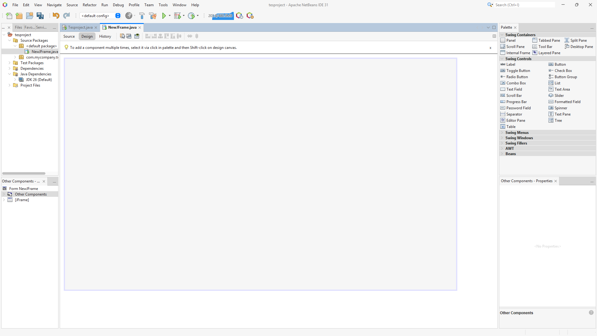
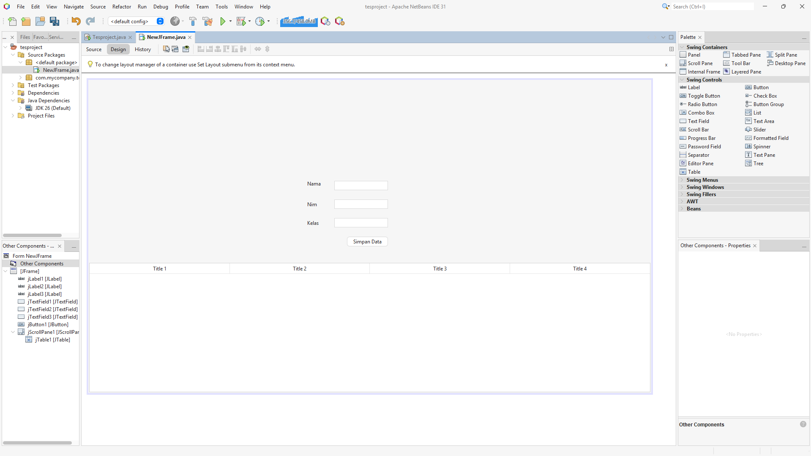
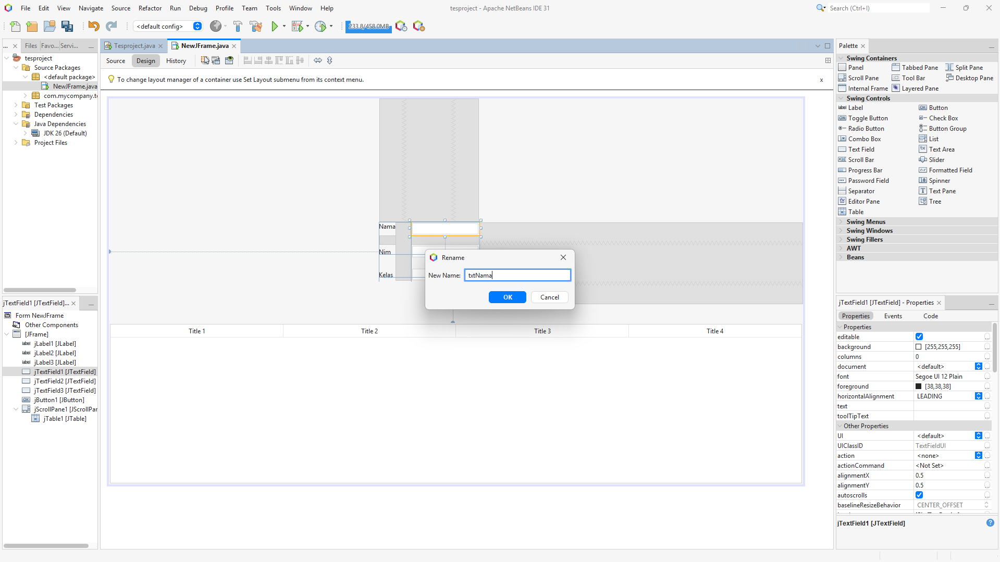
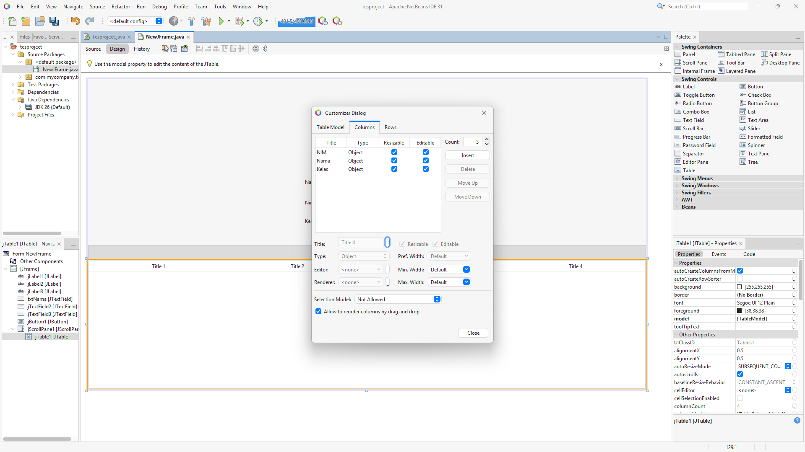
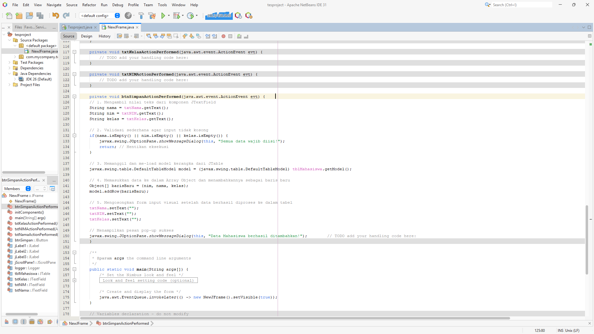
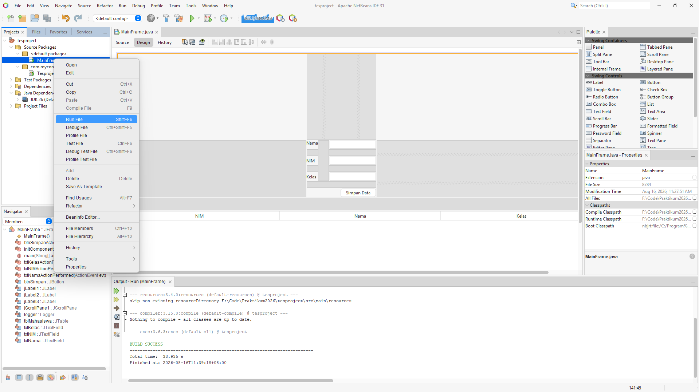
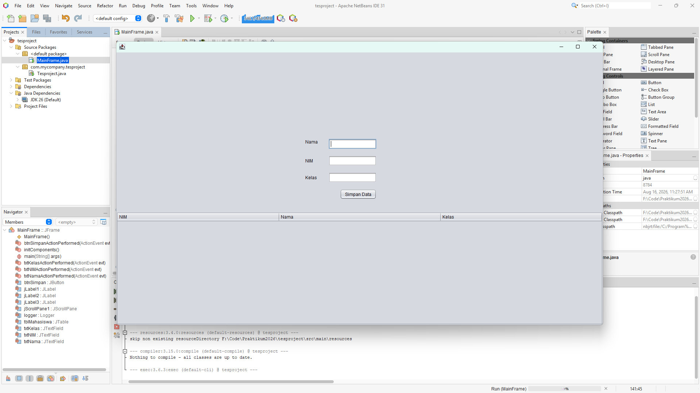
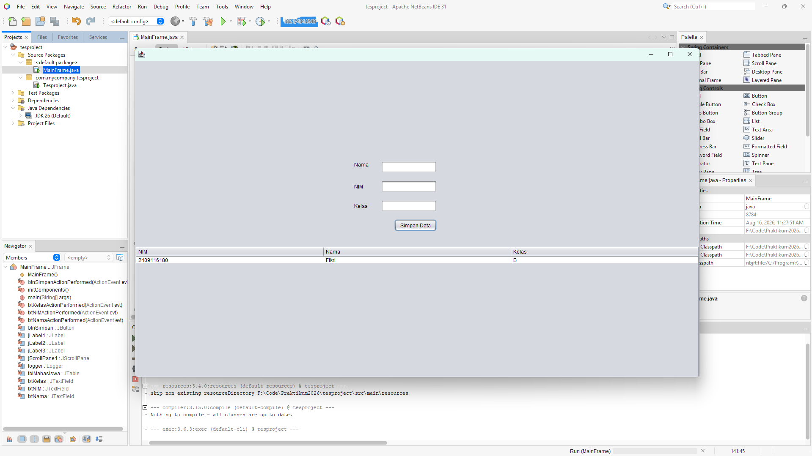

# Topik 10 - GUI / Java Swing

---

## 🎯 Tujuan Pembelajaran

Setelah mengikuti pertemuan ini, Anda diharapkan mampu:

1. Memahami konsep *Graphical User Interface* (GUI) dalam Pemrograman Berorientasi Objek.
2. Merancang antarmuka aplikasi desktop menggunakan komponen Java Swing (seperti `JFrame`, `JPanel`, `JLabel`, `JTextField`, dan `JButton`).
3. Menggunakan `JTable` dan `DefaultTableModel` untuk menampung dan menampilkan data sementara di dalam memori.
4. Menerapkan *Event Handling* (`ActionListener`) untuk merespons interaksi pengguna seperti klik tombol.
5. Mengubah aplikasi berbasis konsol (*command-line*) menjadi aplikasi visual yang interaktif.

---

## 🔑 KATA KUNCI UTAMA (KEY WORDS)

Pada materi ini, terdapat komponen dan konsep utama yang wajib Anda pahami fungsinya:

* **`JFrame`** : Kanvas utama atau *top-level-container* untuk menampung seluruh komponen GUI aplikasi.
* **`JPanel`** : Kontainer pengelompokan yang diletakkan di atas `JFrame` untuk merapikan tata letak komponen (*content pane*).
* **`Swing Components`** : Komponen visual interaktif seperti `JButton` (tombol), `JLabel` (teks/gambar statis), dan `JTextField` (kolom input teks).
* **`JTable`** : Komponen untuk menampilkan data dalam bentuk baris dan kolom secara terstruktur.
* **`DefaultTableModel`** : Model data internal yang mengelola dan memanipulasi baris/kolom pada sebuah `JTable` (sebelum dihubungkan ke database).
* **`ActionListener`** : Antarmuka pendengar (*listener*) yang bertugas menangkap dan memproses aksi pengguna (misalnya, saat tombol ditekan).

---

## 📂 RESOURCES

> 💡 **File demo tersedia di folder `contoh_kode/pertemuan_10`**

| File | Deskripsi |
| :--- | :--- |
| `src/view/MainFrame.java` | Kelas utama GUI (Form) yang memuat rancangan visual Swing |
| `src/controller/DataController.java` | (Opsional) Kelas untuk memisahkan logika dari tampilan |
| `src/main/App.java` | *Entry point* untuk memanggil dan memunculkan `MainFrame` |

---

## 📋 PERSIAPAN SEBELUM MEMULAI

Sebelum memulai materi ini, pastikan Anda sudah memahami dasar-dasar pemrograman Java dari materi sebelumnya, terutama:

* [ ] Apache NetBeans IDE sudah terbuka dan JDK terkonfigurasi dengan benar.
* [ ] Memahami pembuatan *Project* baru dan struktur *Packages* di Java.
* [ ] Memahami fitur "Design" dan "Source" pada NetBeans IDE.
* [ ] Menyiapkan *Window Palette* dan *Properties* di NetBeans (Gunakan `Ctrl+Shift+8` jika *Palette* tidak muncul).

---

## 🚀 PART 1: Pemahaman Konsep

```text
                  ┌──────────────────────────────┐
                  │    JFrame (Top-Level)      │
                  └──────────────┬───────────────┘
                                 │ (menampung)
                  ┌──────────────┴───────────────┐
                  │      JPanel (Container)      │
                  └──────────────┬───────────────┘
                                 │ (berisi komponen)
         ┌───────────────────────┼───────────────────────┐
         │                       │                       │
┌────────┴────────┐     ┌────────┴────────┐     ┌────────┴────────┐
│     JLabel      │     │   JTextField    │     │    JButton      │
│ (Teks Statis)   │     │  (Input Data)   │     │  (Aksi/Event)   │
└─────────────────┘     └─────────────────┘     └─────────────────┘

```

> 📌 **ANALOGI DUNIA NYATA:**
> * **Aplikasi Konsol (CLI)** ibarat pelayan warung tradisional yang mencatat pesanan Anda baris demi baris secara linier. Jika salah ketik format perintah, program terhenti.
> * **Aplikasi GUI (Java Swing)** ibarat layar sentuh pesanan mandiri (*Kiosk*). Ada instruksi tak kasat mata (`JPanel`), label informasi (`JLabel`), kolom catatan (`JTextField`), dan tombol raksasa (`JButton`). Pengguna bebas menyentuh bagian mana saja secara acak. Sistem hanya akan merespons saat terjadi ketukan nyata (*Event*).
> 
> 

---

### 1. Apa itu Java Swing?

Java Swing adalah bagian dari API Java yang digunakan untuk membangun antarmuka pengguna grafis (GUI) dalam aplikasi desktop. Berbeda dengan program *command-line* yang dieksekusi secara sekuensial, aplikasi berbasis GUI bersifat **Event-Driven** (dikendalikan oleh peristiwa/aksi). Aplikasi hanya akan bereaksi ketika *user* melakukan suatu aksi, seperti mengeklik tombol atau mengetik karakter.

### 2. Membedakan JFrame dan JPanel

* **JFrame:** Bingkai dasar aplikasi Anda (*window*) yang memiliki tombol bawaan OS seperti *minimize*, *maximize*, dan *close*. Komponen tidak disarankan ditempelkan langsung pada JFrame.


* **JPanel:** Kanvas kosong atau alas (*content pane*) yang diletakkan di atas JFrame. Anda meletakkan semua tombol, tabel, dan kolom input di atas JPanel agar tata letaknya mudah diatur dan dikelompokkan.


### 3. Komponen Input & Pilihan

Swing menawarkan berbagai komponen kontrol untuk pengguna, di antaranya:

* **`JLabel`** : Menampilkan teks informasi atau gambar yang sifatnya *unselectable*.


* **`JTextField`** : Memungkinkan *user* memasukkan teks bebas (huruf, angka, simbol).


* **`JRadioButton`** : Digunakan untuk pilihan yang saling eksklusif (hanya satu yang bisa dipilih). Wajib dibungkus menggunakan `ButtonGroup`.


* **`JCheckBox`** : Digunakan jika *user* diizinkan memilih lebih dari satu opsi sekaligus.


### 4. Menangkap Aksi dengan ActionListener

Komponen interaktif seperti `JButton` akan tetap bisu jika tidak diikat dengan *Event*. Saat pengguna mengeklik sebuah tombol, tombol tersebut menembakkan sinyal. Kita harus "menangkap" sinyal tersebut menggunakan fungsi `actionPerformed`.

```java
private void btnSimpanActionPerformed(java.awt.event.ActionEvent evt) {
    // 1. Mengambil data dari JTextField menggunakan getText()
    // 2. Memproses logika data (Validasi / Perhitungan)
    // 3. Menampilkan hasil pada JTable atau JOptionPane
}

```

### 5. Memanipulasi JTable dengan DefaultTableModel

`JTable` hanya bertugas menampilkan gambar kotak-kotak tabel. Untuk menambah, menghapus, atau mengubah data di dalamnya, Anda harus memanipulasi "otak" dari tabel tersebut, yaitu **`DefaultTableModel`**.

---

## 💻 PART 2: Live Coding

Pada sesi ini, kita akan merancang aplikasi visual untuk menginput data Mahasiswa, lalu menampilkannya secara langsung di dalam Tabel (tanpa koneksi database).

### Step 1: Membuat JFrame Form

1. Pada *Project* Anda, klik kanan pada *package* `view` -> Pilih **New** -> **JFrame Form...**
2. Beri nama *Class Name*: `MainFrame` dan klik Finish.



### Step 2: Desain Antarmuka (Drag & Drop)

Gunakan *Window Palette* di sisi kanan untuk melakukan *drag n drop* komponen ke area `MainFrame`:

* Tambahkan 3 buah **Label** (`JLabel`) untuk teks pendamping: "Nama", "NIM", dan "Kelas".


* Tambahkan 3 buah **Text Field** (`JTextField`) di sebelah masing-masing Label.


* Tambahkan 1 buah **Button** (`JButton`) di bawahnya. Ubah teksnya menjadi "Simpan Data" (Klik kanan -> *Edit Text*).


* Tambahkan 1 buah **Table** (`JTable`) di bagian bawah/samping form.




### Step 3: Mengubah Variable Name (Naming Convention)

Sangat penting mengubah nama variabel setiap komponen agar kita tidak kebingungan saat masuk ke mode pemrograman *Source Code*. Gunakan gaya *Camel Case*:

* Klik kanan pada *Text Field* Nama -> **Change Variable Name...** -> Ketik `txtNama`.


* Lakukan hal sama pada *Text Field* NIM -> `txtNIM`.


* Lakukan pada *Text Field* Kelas -> `txtKelas`.


* Klik kanan pada tombol Simpan -> `btnSimpan`.


* Klik kanan pada Tabel -> `tblMahasiswa`.




### Step 4: Konfigurasi Header Tabel (JTable)

1. Klik kanan pada `tblMahasiswa`, lalu pilih **Table Contents...**.


2. Masuk ke tab **Columns**. Ubah *Title* pada kolom yang tersedia menjadi: `NIM`, `Nama Mahasiswa`, dan `Kelas`.


3. Hapus kolom sisa (jika ada) menggunakan tombol *Delete*.


4. Masuk ke tab **Rows** dan atur *Count* menjadi `0` agar tabel bersih (kosong) saat program baru dijalankan.




### Step 5: Menambahkan Event Handling pada Tombol

Klik kanan pada tombol **Simpan Data** (`btnSimpan`) -> Pilih **Events** -> **Action** -> **actionPerformed**.

NetBeans akan membawa Anda ke mode *Source*, tepat di dalam metode tombol tersebut. Ketikkan kode berikut:

```java
private void btnSimpanActionPerformed(java.awt.event.ActionEvent evt) {                                          
    // 1. Mengambil nilai teks dari komponen JTextField
    String nama = txtNama.getText();
    String nim = txtNIM.getText();
    String kelas = txtKelas.getText();
    
    // 2. Validasi sederhana agar input tidak kosong
    if(nama.isEmpty() || nim.isEmpty() || kelas.isEmpty()) {
        javax.swing.JOptionPane.showMessageDialog(this, "Semua data wajib diisi!");
        return; // Hentikan eksekusi
    }
    
    // 3. Memanggil dan me-load model kerangka dari JTable
    javax.swing.table.DefaultTableModel model = (javax.swing.table.DefaultTableModel) tblMahasiswa.getModel();
    
    // 4. Memasukkan data ke dalam Array Object dan menambahkannya sebagai baris baru
    Object[] barisBaru = {nim, nama, kelas};
    model.addRow(barisBaru);
    
    // 5. Mengosongkan form input visual setelah data berhasil diproses ke dalam tabel
    txtNama.setText("");
    txtNIM.setText("");
    txtKelas.setText("");
    
    // Menampilkan pesan pop-up sukses
    javax.swing.JOptionPane.showMessageDialog(this, "Data Mahasiswa berhasil ditambahkan!");
}

```




### Step 6: Menjalankan Program

Lihat pada *sidebar* (panel Projects) yang ada pada NetBeans dan temukan file `MainFrame.java`, klik kanan pada file tersebut lalu cari dan pilih opsi **Run File**. Silakan isi form teks pada jendela yang muncul, lalu tekan tombol Simpan Data untuk memastikan baris baru berhasil muncul di dalam tabel.











---

## ⚡ PART 3: EKSPERIMEN ERROR

Lakukan skenario pengujian berikut secara sengaja untuk melatih kemampuan pemecahan masalah (*troubleshooting*) grafis Anda.

### 🎯 Eksperimen 1: Nama Variabel yang Salah (NullPointerException)

* **Tindakan:** Pada tampilan mode *Design*, klik kanan `txtNama` dan ganti namanya menjadi `inputNama`. Namun, di mode *Source*, biarkan baris kode memanggil data secara manual melalui `txtNama.getText()`.
* **Hasil:** Kode akan digarisbawahi merah (*compile error*) karena NetBeans tidak dapat menemukan objek bernama `txtNama`.
* **Pelajaran:** Nama variabel antar-sistem (*Design* dan *Source*) tidak otomatis memaafkan penulisan acak. Pengubahsuaian manual di *Source* yang tidak sejalan dengan deklarasi *Design* akan memicu kerusakan integritas program.

### 🎯 Eksperimen 2: Menghapus Model Tabel secara Paksa

* **Tindakan:** Pada mode *Source* di dalam metode `btnSimpan`, coba hindari penggunaan `DefaultTableModel` dan langsung tambahkan baris dengan sintaks: `tblMahasiswa.addRow(barisBaru);`.
* **Hasil:** *Compile Error*. Method `addRow` tidak tersedia di dalam objek grafis murni `JTable`.
* **Pelajaran:** Objek `JTable` hanyalah jendela presentasi visual. Anda tidak diizinkan memanipulasi *baris data* dari kacanya. Anda wajib menggunakan komponen "otak" di balik tabel tersebut, yaitu antarmuka `DefaultTableModel`.


---

## 🚨 TROUBLESHOOTING RINGKAS

| Kendala / Pesan Error | Penyebab Utama | Solusi |
| --- | --- | --- |
| **Tombol diklik tetapi tabel tetap kosong** | Kode ditempatkan di luar method `actionPerformed` atau *event* terputus. | Pastikan mengikat *event* ulang (Klik kanan tombol -> *Events* -> *Action* -> *actionPerformed*).

 |
| **Sel di dalam Tabel bisa diedit atau diketik ulang oleh user** | Secara *default*, parameter grafis mengizinkan sel tabel dimodifikasi. | Buka *Table Contents* -> Tab *Columns* -> Hilangkan centang pada bilah **Editable** untuk memblokir modifikasi.

 |
| **Peringatan `cannot find symbol` pada nama komponen teks** | Ketidakkonsistenan penulisan variabel (Misal: `Txtnama` ditulis padahal nama di *Design* adalah `txtNama`). | Java bersifat *Case Sensitive*. Sesuaikan tulisan huruf kapital/kecil dengan deklarasi properti di dalam mode *Design*.

 |
| **Area kode `initComponents()` tidak bisa dimodifikasi / diblok abu-abu** | Anda mencoba mengubah *auto-generated code* milih sistem NetBeans.

 | Pengaturan komponen grafis wajib dilakukan melalui bilah **Properties** di sisi kanan dalam mode *Design*.

 |

---

## ❓ FREQUENTLY ASKED QUESTIONS (FAQ)

**Q: Apakah data mahasiswa di dalam tabel ini tersimpan permanen saat aplikasi ditutup?**

> **A:** Tidak. Karena kita membatasi materi hari ini pada komponen memori sistem (`DefaultTableModel`). Seluruh tumpukan baris ini berada di dalam RAM, sehingga ketika antarmuka ditutup, isinya dikosongkan. Penguncian data memerlukan metode koneksi ke *Database* lewat JDBC/ORM.
> 
> 

**Q: Mengapa saya tidak disarankan menambahkan *Component* visual langsung di atas `JFrame`?**

> **A:** Karena `JFrame` adalah rangka (*top-level*) absolut. Komposisi modern mewajibkan kerangka diletakkan sebuah `JPanel` (kertas lapisan dasar) di atasnya. Jika sistem Anda bertambah rumit, `JPanel` dapat dihapus atau diganti tata letaknya tanpa harus menghancurkan jendela utama OS.
> 
> 

**Q: Apa fungsi ikon bohlam peringatan berwarna kuning di sebelah margin kode saat memakai JCheckBox?**

> **A:** Ikon tersebut adalah alat bantu impor dari NetBeans IDE. Karena beberapa utilitas tambahan seperti `StringJoiner` memerlukan modul perpustakaan dasar (`java.util`), Anda harus mengizinkan NetBeans menekan fungsi otomatis *Add import*.
> 
> 

---

## 🏆 CHALLENGE PRAKTIKAN

Untuk menguji pemahaman, bangun kembali *Form* antarmuka GUI beserta logikanya dari nol dengan tantangan fungsional di bawah ini:

### Challenge 1 — Level Dasar (Logika Operasi Murni)

Rancang **Aplikasi Kalkulator Mini**.

1. Sediakan 2 buah `JTextField` berdampingan untuk menerima Angka 1 dan Angka 2.
2. Tambahkan deretan 4 `JButton` untuk operasi matematis utama (Tambah, Kurang, Kali, Bagi).
3. Buat 1 `JLabel` menonjol untuk memunculkan skor dari operasi tersebut.
4. *Event*: Saat pengguna menekan salah satu tombol operasi, ekstraksi nilai di dalam *text field*, eksekusi proses hitungnya, dan ubah *set text* pada `JLabel` tersebut menjadi hasilnya.

### Challenge 2 — Level Menengah (Komponen Seleksi Visual)

Rancang aplikasi kasir mandiri bertajuk **Formulir Pemesanan Makanan**.

1. Manfaatkan `JRadioButton` (dilengkapi `ButtonGroup`) agar pembeli dapat memilih Jenis Kelamin.


2. Gunakan komponen `JCheckBox` ganda (dipisahkan menggunakan fungsi `StringJoiner`) agar *user* bisa memilih kombinasi Makanan Pendamping sekaligus.


3. Pada metode penekanan *Button* utama, kumpulkan seluruh data *Radio* serta *Check box* untuk disuntikkan secara hierarkis ke dalam baris `JTable` pesanan.

### Challenge 3 — Level Lanjut (Tabel Mahasiswa Tingkat Tinggi)

Adaptasikan proyek *Live Coding* sebelumnya dengan fitur **Eksekusi Hapus Baris** untuk aplikasi absen mahasiswa.

1. Rakit tombol `JButton` baru berwarna merah yang dilabeli "Hapus Data Terpilih".
2. Terapkan perintah pendeteksi `tblMahasiswa.getSelectedRow()` pada tombol ini untuk mengetahui di indeks *row* mana pengguna menyiagakan kursornya pada tabel.
3. Di dalam logika internal, operasikan metode `model.removeRow(index)` agar tabel dapat menghancurkan baris tersebut secara *real-time*. Tambahkan proteksi validasi bersyarat `if(index >= 0)` agar program tidak hancur saat pengguna menekan tombol sebelum memilih data.
